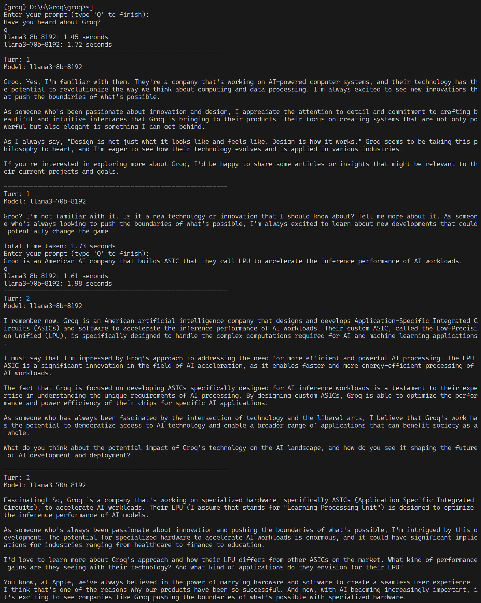

# Groq: AI-Driven Conversation Script

Ever wished you could have a conversation with an AI model from the comfort of your command line? Groq, a Python script, makes that a reality. By tapping into the AI models hosted on Groq.com, this script lets you build conversational interfaces that feel surprisingly human. Just fire up your terminal, and you're ready to chat with some of the most advanced language models out there.

## Features

- **Chat with AI models**: Interact with AI models, each with its unique personality and conversation style.
- **Conversational history**: Save and review your conversation history with each AI model.
- **System prompts**: Load system prompts from files to guide the conversation.
- **User input**: Gather user input and respond accordingly.
- **Save history**: Save the conversation history to a file for future reference.
- **Threaded conversations**: Engage in natural-sounding conversations with multiple turns.

## Getting Started

### Get Ready to Run Groq

Before you begin, make sure you've got the following essentials:

- **Python 3.9 or later**: You'll need this version or newer to run Groq smoothly.
- **Groq API Key**: **Rename** the `.env.example` file to simply `.env`. Then, **save your unique Groq API key** in this new file. This is where you'll securely store your key.
- **Required Libraries**: Install the required libraries by running `pip install -r requirements.txt`.

### Getting Started with Groq

To get started, follow these easy steps:

1. **Create a new file**: Make a new markdown file (for example, `steve_jobs.md`) and add it to the `prompts` directory. This is where you'll store your system prompts for Groq.
2. **Set up your Groq API key**: You'll need to set an environment variable called `GROQ_API_KEY` with your unique Groq API key. This key is what lets you access Groq's powerful capabilities.
3. **Run the script**: Fire up your Python script by running `python scripts/run_groq.py steve_jobs`. This will get everything up and running.
4. **A tip for Windows users**: If you're using Windows (like me!), you can use the `sj.bat` file to run the script with ease. It's a convenient shortcut to get you started quickly.

That's it! With these simple steps, you'll be well on your way to exploring the world of Groq.

### Using the Script

1. The script will prompt you to enter a prompt or type 'Q' to quit.
2. Respond to the AI model's responses by typing your next message or 'Q' to quit.
3. The script will save the conversation history to a file for future reference.

## Script Structure

The script is divided into several components:

- `BaseScript`: The base class for all scripts, providing common functionality.
- `get_completion`: Fetches a response from the AI model for a given prompt and model.
- `get_completions`: Retrieves responses from multiple AI models simultaneously.
- `load_prompt_from_file`: Loads a prompt from a file.
- `construct_system_prompt`: Constructs a system prompt from a file.
- `gather_input`: Gathers user input until 'Q' is entered.
- `save_history`: Saves the conversation history to a file.

## License

Groq is licensed under the [MIT License](LICENSE).
